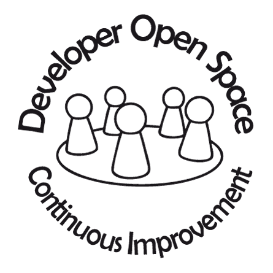

Web: https://devopenspace.de/  
Twitter: http://twitter.com/devopenspace

Datum: 13.Oktober 2017

#Workshop: .NET in the big box
mit Frank Pommerening 

## Inhalt
1. [Zielgruppe](#zielgruppe)
2. [Inhalt](#inhalt)
3. [Teilnehmer-Voraussetzung / Vorbereitung](#voraussetzungen)

## 1. Zielgruppe
Der Workshop richtet sich an (.NET-) Entwickler die weitergehende Themen rund um Docker kennen lernen möchten. Es werden bereits Erfahrungen mit Docker-Files und Docker-Compose benötigt.

 
## 2. Inhalt
Die folgende Liste gibt einen Überblick über mögliche Themen.
- Containerbasierter Build (.NET Core Anwendung)
   - Defintionen mit Cake
   - Integration Microsoft Visual Studio Online
- Multihost-Anwendungen mit Docker Swarm
   - Docker Swarm vs. Docker Swarm Mode
   - Service-Definition
   - Verknüpfung mit Docker-Compose / Docker-Stack
   - Swarm auf Raspberry PI
- Serverless Computing mit OPENFAAS
   - Grundlagen / Architektur
   - Funktionensentwicklung mit .NET Core bzw. node.js 
   - Verwendung mit Amazon Alexa (Ausblick) 

3. Teilnehmer-Voraussetzungen / Vorbereitung
[x] Notebook mit LAN-Zugang für Zugriff auf lokale Ressourcen
[x] <a href="https://code.visualstudio.com/" target="_blank">Visual Studio Code</a>  mit den Plugins
- Docker (Microsoft)
- C# (Microsoft)
 
[x] Dockerumgebung z.B. <a href="https://www.docker.com/products/docker-toolbox" target="_blank">Docker-Toolbox</a> oder <a href="https://docs.docker.com/docker-for-windows/" target="_blank"> Docker for Windows</a> (<b>empfohlen</b>) 
[x] Account für Dockerhub und Microsoft Visual Studio Online

<b>Die Präsentation könnt ihr auf der <a href="http://fpommerening.github.io/DevOpenSpace2017/index.html"  target="_blank">GitHub-Page</a> einsehen.</b> (Hinweis: die finale Version wird nach der Veranstaltung bereitgestellt.)